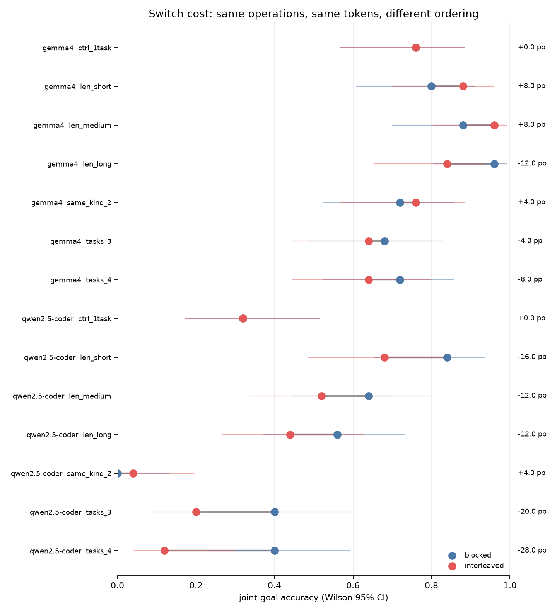

# taskswitch

**Measuring ordering effects when a language model has several live task states.** The
same operations are presented blocked or interleaved, with token count held constant,
across three context lengths and up to four tasks.

> **Status:** research prototype, not a benchmark. The prespecified primary comparison
> was inconclusive; the remaining patterns are exploratory. See
> [Limitations](docs/LIMITATIONS.md).

**Primary result.** On `qwen2.5-coder:7b`, the repository-prespecified two-task,
medium-context comparison estimated a −12.0 percentage-point ordering difference, with a
95% paired-bootstrap interval of [−36.0, +12.0] and exact McNemar p=0.508. At n=25, that
is inconclusive: it establishes neither a switch cost nor its absence.

**Exploratory pattern.** At a fixed token count and fixed total operation count, qwen's
point estimates became more negative as the number of live states increased:

| live tasks | delta | 95% paired-bootstrap interval | raw p | misattribution entries |
|---:|---:|---|---:|---:|
| 2 | −12.0pp | [−36.0, +12.0] | 0.508 | 0 |
| 3 | −20.0pp | [−36.0, −4.0] | 0.063 | 8 |
| 4 | −28.0pp | [−48.0, −8.0] | 0.039 | 59 |

| context padding | delta | 95% paired-bootstrap interval | raw p |
|---:|---:|---|---:|
| 0 noise turns | −16.0pp | [−36.0, +0.0] | 0.219 |
| 40 noise turns | −12.0pp | [−36.0, +12.0] | 0.508 |
| 120 noise turns | −12.0pp | [−36.0, +12.0] | 0.508 |

The corresponding context-padding estimates were −16, −12 and −12 points. This is a
hypothesis-generating shape, not a demonstrated trend or interaction: the cells are
underpowered, no formal trend test was prespecified, task composition changes with task
count, and the exploratory p-values require familywise correction.

**Most useful mechanism probe.** v1 observed zero misattribution across dissimilar task
kinds. In v2, adding a same-kind neighbour was sufficient to expose misattribution in
qwen: the instrument recorded 12 discrepancy entries in `same_kind_2`, versus zero in
the matched two-task different-kind cell. Those are descriptive, conversation-clustered
taxonomy entries rather than independent events; they do not establish that similarity
is necessary or that task count has no effect.

**What the run supports.** Across 700 conversations, all 700 blocked/interleaved members
matched their partner's token count exactly. The paired outcomes show that ordering often
changes whether a conversation succeeds, but the current design does not attribute every
difference solely to switching: fixed blocked-task order also changes serial position and
recency. Treat the table as evidence that the manipulation is measurable and worth a
counterbalanced confirmatory run.

| arm | `qwen2.5-coder:7b` | `gemma4:12b` |
|---|---|---|
| length (0 / 40 / 120 noise turns) | −16 / −12 / −12 pp | +8 / +8 / −12 pp |
| task count (2 / 3 / 4 tasks) | −12 / −20 / **−28** pp | +8 / −4 / −8 pp |

Both models' task-count point estimates become more negative, but the primary is
inconclusive and no exploratory cell remains significant after familywise correction.
The cross-model comparison is descriptive because family, tuning, size and calibrated
difficulty all change together.

**Read the task-count arm with its confound attached.** Under the canonical composition,
the number of same-kind pairs rises with task count. `same_kind_2` adds one targeted
comparison on `qwen2.5-coder:7b`:

| cell | tasks | same-kind pairs | misattribution |
|---|---:|---:|---:|
| `len_medium` | 2 | 0 | 0 |
| **`same_kind_2`** | **2** | **1** | **12** |
| `tasks_3` | 3 | 1 | 8 |
| `tasks_4` | 4 | 2 | 59 |

At fixed task count, adding a same-kind neighbour changed the observed count from 0 to
12. At one same-kind pair, moving from two to three tasks changed it from 12 to 8. This
shows that the original monotone task-count story was not identified; it does not by
itself estimate a causal similarity or task-count effect. Interleaved conversations
contained more such entries descriptively, while blocked conversations still produced
29 of 79. `gemma4:12b` recorded zero across its 350 conversations.

The same-kind qwen cell landed on the floor: blocked accuracy moved from 0.640 in the
different-kind two-task cell to 0.000. That comparison changes task structure and surface
semantics together, so it is a diagnostic result, not a clean similarity effect. Its
ordering delta is uninterpretable at the floor. Gemma's copy was not on the floor
(0.880 → 0.720 blocked) and showed no detectable ordering cost.



## The problem

People do not use assistants one task at a time. They start a list, jump to a schedule,
come back to the list, correct themselves, and drop asides that are not tasks at all.
Every deployed stateful assistant runs in that mode.

The existing multi-turn benchmarks measure something else: a single task that *evolves*
([MultiChallenge](https://arxiv.org/abs/2501.17399),
[Multi-IF](https://arxiv.org/abs/2410.15553)), long-context retrieval
([RULER](https://arxiv.org/abs/2404.06654)), or recall of one long thread
([LoCoMo](https://arxiv.org/abs/2402.17753)). [GoodAI's LTM
Benchmark](https://arxiv.org/abs/2409.20222) does interleave concurrent tasks and found
that it hurts — but it varies interleaving and context length together.

The intended contribution is deliberately narrow: a mechanically graded, paired,
matched-token instrument for comparing blocked and interleaved concurrent state updates.
The current run is exploratory because serial position and recency are not yet
counterbalanced.

**Who it is for:** anyone choosing a model for an assistant that holds state across a
conversation, and anyone who has to defend that choice.

## How it works

A seeded generator emits an operation sequence over two task types with independently
diffable state — a shopping list (a **set**) and a meeting schedule (an **ordered
map**). A plain state machine consumes *the same sequence* to compute the expected final
state, so the transcript and its answer key come out of one function as a pair and
**grading is a diff**. No judge model, no annotation.

Each sequence then runs in two orderings:

```
ops:  [S1 S2 S3]  [C1 C2 C3]            (S = shopping, C = calendar)

BLOCKED      S1 S2 S3 C1 C2 C3         1 task transition
INTERLEAVED  S1 C1 S2 C2 S3 C3         5 task transitions
```

Same operations. Same rendered strings. **Same token count** — assistant turns are
prefilled with a fixed `"Got it."`, so the two prompts are the identical multiset of
strings in a different order and cannot tokenise differently. Verified at run time
against Ollama's own `prompt_eval_count`, not estimated.

An accuracy delta is an ordering effect under this instrument. A confirmatory switch-cost
claim requires counterbalancing blocked-task order and interleaved starting position.

See [`docs/WALKTHROUGH.md`](docs/WALKTHROUGH.md) for one conversation traced end to end,
generated from real output.

> **Working offline?** Run `./tools/preflight.sh` while you still have wifi — it verifies
> the venv, models, cache and every offline command end to end. See
> [`OFFLINE.md`](OFFLINE.md).

## Quickstart

```bash
uv venv --python 3.12 .venv          # 3.14 has thin scipy/matplotlib wheel coverage
uv pip install --python .venv/bin/python -e ".[dev]"
ollama pull qwen2.5-coder:7b

.venv/bin/python -m pytest tests/ -q   # no model required
.venv/bin/python run.py --demo         # 5 pairs, ~2 min
```

Committed sample output is in [`results/sample.jsonl`](results/sample.jsonl) and the
plots are in `results/`, so a reviewer who runs nothing still sees output.

Full sweep:

```bash
export OLLAMA_KEEP_ALIVE=-1 OLLAMA_NUM_PARALLEL=1 OLLAMA_KV_CACHE_TYPE=q8_0
.venv/bin/python run.py --calibrate                  # find the measurable band FIRST
.venv/bin/python run.py --config configs/main.yaml   # the sweep
.venv/bin/python run.py --analyse                    # stats + plots
.venv/bin/python run.py --rescore                    # re-score from cache, no inference
```

## Results

Full tables in [`results/RESULTS.md`](results/RESULTS.md), rendered directly from the
data by `tools/make_readme_results.py` so the numbers cannot drift from the run. Power
analysis in [`results/POWER.md`](results/POWER.md).

<!-- BEGIN:results-table -->
| model | condition | blocked | interleaved | delta (pp) | McNemar b/c | raw p | Bonferroni p |
|---|---|---:|---:|---:|---|---:|---:|
| `gemma4:12b` | ctrl_1task *(control)* | 0.760 | 0.760 | +0.0 | 0/0 | 1.000 | — |
| `gemma4:12b` | len_short *(exploratory)* | 0.800 | 0.880 | +8.0 | 0/2 | 0.500 | 1.000 |
| `gemma4:12b` | len_medium *(exploratory)* | 0.880 | 0.960 | +8.0 | 0/2 | 0.500 | 1.000 |
| `gemma4:12b` | len_long *(exploratory)* | 0.960 | 0.840 | -12.0 | 4/1 | 0.375 | 1.000 |
| `gemma4:12b` | same_kind_2 *(exploratory)* | 0.720 | 0.760 | +4.0 | 3/4 | 1.000 | 1.000 |
| `gemma4:12b` | tasks_3 *(exploratory)* | 0.680 | 0.640 | -4.0 | 4/3 | 1.000 | 1.000 |
| `gemma4:12b` | tasks_4 *(exploratory)* | 0.720 | 0.640 | -8.0 | 4/2 | 0.688 | 1.000 |
| `qwen2.5-coder:7b` | ctrl_1task *(control)* | 0.320 | 0.320 | +0.0 | 0/0 | 1.000 | — |
| `qwen2.5-coder:7b` | len_short *(exploratory)* | 0.840 | 0.680 | -16.0 | 5/1 | 0.219 | 1.000 |
| `qwen2.5-coder:7b` | **len_medium (PRIMARY)** | 0.640 | 0.520 | -12.0 | 6/3 | 0.508 | — |
| `qwen2.5-coder:7b` | len_long *(exploratory)* | 0.560 | 0.440 | -12.0 | 6/3 | 0.508 | 1.000 |
| `qwen2.5-coder:7b` | same_kind_2 *(exploratory)* | 0.000 | 0.040 | +4.0 | 0/1 | 1.000 | 1.000 |
| `qwen2.5-coder:7b` | tasks_3 *(exploratory)* | 0.400 | 0.200 | -20.0 | 5/0 | 0.062 | 0.688 |
| `qwen2.5-coder:7b` | tasks_4 *(exploratory)* | 0.400 | 0.120 | -28.0 | 8/1 | 0.039 | 0.430 |
<!-- END:results-table -->

Three things to read carefully:

**The primary is inconclusive, and I am reporting it as the primary.** `len_medium` came back at
−12.0pp, p=0.508. Its discordant counts were b=6, c=3 — interleaving broke six
conversations and fixed three, and nine discordant pairs cannot separate a real 12-point
effect from noise. A 12-point point estimate with a CI spanning [−36, +12] is not evidence
of an effect and not evidence of its absence; it is an underpowered cell
(see [POWER.md](results/POWER.md)). `tasks_4` reached raw p=0.039, but it is exploratory
and does not survive familywise correction. Promoting it to the headline would be
selecting on the result, so it is reported with its confounds attached.

**The paired design exposes outcome instability that marginal accuracy hides.** Across
non-control cells, discordance — the share of conversations whose outcome *changed* with
ordering — ranges 4–36% for `qwen2.5-coder:7b` and 8–28% for `gemma4:12b`. Those ranges
overlap and include heterogeneous cells; they are descriptive, not evidence of a model
ranking or scale effect.

**Noise sensitivity was model-dependent in this run, and the two models move in opposite
directions.** Blocked accuracy across the length arm (0 → 40 → 120 padding turns,
identical seeds): `qwen2.5-coder:7b` falls **0.840 → 0.640 → 0.560**, while `gemma4:12b`
*rises* **0.800 → 0.880 → 0.960**. Padding costs one model 28 points and gains the other
16. I originally wrote this up as a general finding about context padding from the qwen
data alone, before gemma had run; it is not general, and the v2 data make the sign
disagreement sharper than v1 did. Note what this does to the length arm: "no length
effect" is a statement about the *ordering delta*, not about difficulty — length moves
accuracy a great deal, just not the gap between orderings.

### What actually went wrong in v1

| failure mode | share |
|---|---:|
| absorbed / false assertion | 38.1% |
| dropped / vanished | 30.9% |
| absorbed / hallucination | 21.6% |
| absorbed / stale value | 6.7% |
| dropped / wrong value | 2.6% |
| **misattributed** | **0.0%** |

This archived v1 table is retained because it motivated the v2 instrument change.
Misattribution was the failure the design was built to detect — the two task types were
chosen so a grocery item in a schedule would be unmissable. It occurred **zero times in
480 conversations** in v1, which could not say whether models simply do not misfile across
dissimilar tasks or whether two tasks was too few for misfiling to arise. v2 can
distinguish these: it runs three and four concurrent tasks, including two lists of the
*same kind* with disjoint vocabularies, so `screws` on the grocery list is as unmistakable
as `milk` in a calendar ([D17](docs/DECISIONS.md)).

## The most important decisions

Full log with rejected alternatives: [`docs/DECISIONS.md`](docs/DECISIONS.md).

- **Mechanical ground truth over an LLM judge.** The domain was chosen so a judge is
  unnecessary. Costs realism, buys unambiguous grading.
- **Prefilled assistant acknowledgements.** Makes the token match provable rather than
  estimated, and the sweep ~10× cheaper. Costs interactivity: this measures extraction
  over a transcript, not live turn-by-turn tracking. *This is the most consequential
  tradeoff in the project.*
- **`n_ops` is total per conversation, not per task**, so raising the task count does
  not lengthen the conversation.
- **Context length varied with noise turns, not more operations**, so length does not
  ride along with state-update load.
- **Calibration before the sweep.** v1 calibration prevented a floor result, but it did
  not transfer cleanly after v2 changed the templates and noise construction.
- **A 1-task negative control.** With nothing to interleave the delta must be exactly
  zero; a non-zero result there would mean the harness manufactures differences.

### Changed direction

Three things I got wrong and had to fix:

1. **The output schema was ambiguous, and the ambiguity correlated with the condition.**
   The schedule was requested as an array of two strings without saying which was the
   time. The first live run returned `[title, time]` when blocked and `[time, title]`
   when interleaved — same model, same tokens — and the scorer read the difference as
   six tracking failures in a conversation the model had tracked *perfectly*. That would
   have shipped a large, clean, entirely fictitious switch cost. An ambiguous instrument
   is not merely noisy; if the ambiguity resolves differently per condition it becomes a
   **systematic** effect.

2. **A shared RNG made the length arm change the operations.** One `Random` threaded
   through every task meant generating noise for task 1 shifted task 2's whole operation
   stream. The same class of confound this project exists to remove, one level down, in
   my own generator. Caught by a test that asserted the invariant rather than the output.

3. **The task-count arm was silently degenerate — cut in v1, rebuilt in v2.** The design
   called for 2/3/4 concurrent tasks, but task identity was `TaskKind` and only two kinds
   existed, so "3 tasks" resolved to `[shopping, schedule, shopping]` — the duplicate
   merged into the first list's state and blocked ordering emitted its turns twice. The
   token-match assertion caught it and v1 shipped without the arm
   ([D14](docs/DECISIONS.md)).

   v2 rebuilds it properly: task identity is a **slot**, and each slot draws from a
   disjoint vocabulary, so two shopping lists stay distinguishable
   ([D17](docs/DECISIONS.md)). One further trap on the way — the library cap was lifted
   but a stale guard survived in `run.py`, so 538 green tests coexisted with a crashing
   entry point. The tests called `build_pair` directly and nothing exercised the CLI's
   task construction.

4. **The planned difficulty was on the floor.** The design called for `n_ops=24`.
   Measured difficulty curve for `qwen2.5-coder:7b` at 2 tasks:

   | n_ops | 6 | 12 | 18 | 24 |
   |---|---|---|---|---|
   | blocked joint accuracy | 0.62 | 0.38 | 0.12 | **0.00** |

   At the planned value every cell would have sat at zero in both orderings and the
   sweep would have reported "no switch cost" for reasons having nothing to do with
   switching. `run.py --calibrate` exists to catch exactly this, and did.

## Tools

- **Claude Code (Opus 5)** — implementation bodies written against a hand-authored
  interface skeleton and an explicit decision log. The problem framing, experimental
  design, confound analysis, failure taxonomy, the choice to pair, and the choice of
  estimators were authored by hand and are recorded in
  [`docs/DECISIONS.md`](docs/DECISIONS.md). Every generated diff was read before commit.
  Two of the three bugs above were caught by tests written to assert invariants I had
  specified.
- **Ollama 0.32.14** — local inference. Models: `qwen2.5-coder:7b`
  (digest `dae161e27b0e90dd`, Q4_K_M) and `gemma4:12b` (Q4_K_M).
- **numpy / scipy** — `binomtest` for the exact McNemar p-value. Wilson intervals, the
  paired bootstrap and the clustered SE are implemented directly in
  [`taskswitch/stats.py`](taskswitch/stats.py), not taken from a library, because they
  need to be defensible line by line. See [`docs/STATS.md`](docs/STATS.md).

## Validation

- **A model-free test suite** whose load-bearing checks assert that inert operations
  mutate nothing and that blocked and interleaved orderings of one operation list produce
  identical ground truth.
- **Token match verified at run time** against `prompt_eval_count` for every pair; drift
  is reported and drifting pairs are excluded.
- **Difficulty measured before v1**, which prevented the planned `n_ops=24` floor. The
  v2 template change invalidated that calibration; the primary remained measurable, but
  current calibration is an acknowledged gap rather than a completed validation gate.
- **Format failures counted separately** from state failures and excluded from state
  accuracy, so a formatting problem is never reported as a tracking problem.
- **Constrained vs free-form decoding measured, not assumed** (`run.py
  --check-constrained`): 0.667 vs 0.583 joint accuracy, both at parse rate 1.000, n=12.
  That is a one-conversation difference and is reported as underpowered rather than as a
  result. Free-form runs get a second extraction pass, because without one the check
  compares JSON emission rather than state tracking — the first version reported a
  fictitious +66.7pp advantage for constrained decoding purely because unconstrained
  answers came back as correct markdown prose. See [D16](docs/DECISIONS.md) and
  [LIMITATIONS §8](docs/LIMITATIONS.md).
- **Clustered standard errors**, printed alongside the naive ones so the ratio is
  visible rather than asserted.
- **Taxonomy grounding audit** (`tools/audit_taxonomy.py`): every failure the scorer
  emits is checked against the actual expected-vs-reported diff. It found a real
  mislabelling — stale values reported as hallucinations — which no accuracy number
  would ever have surfaced. Until the optional human review sample is filled in, this
  project has a *grounding* check, not an inter-rater *agreement* number, and says so.
  With `--output`, the tool can write that blind review sample explicitly.
- `run.py --rescore` recomputes every score from cache with no inference, so the
  taxonomy can be revised without paying for the sweep twice. Re-scoring after the
  taxonomy fix changed the labels and **0 outcomes**, confirming diagnosis and scoring
  are properly separated.

## Limitations

Summarised here, in full at [`docs/LIMITATIONS.md`](docs/LIMITATIONS.md).

1. **This measures extraction, not live tracking.** Prefilled acks remove the model's
   own replies, which in a real deployment may act as a scratchpad.
2. One synthetic domain, templated turns. No generalisation claim.
3. **The task-count arm measures a narrower question than its name suggests.** Because
   `n_ops` is total per conversation, fewer tasks means *more operations per task* — the
   1-task control is one six-item list, not an easier condition. The arm asks "at fixed
   total work and fixed tokens, does splitting across more live states cost you?", not
   "does adding a task hurt?" See [LIMITATIONS §4c](docs/LIMITATIONS.md).
4. Cross-model comparison is **descriptive only** — the two models differ in family,
   tuning and size simultaneously. There is no scaling ladder.
5. The length arm confounds context length with distraction, since padding is what
   varies.
6. Underpowered for small effects at this `n_pairs`; a non-significant cell means
   "underpowered", not "no effect".
7. Bit-exact reproducibility is not achievable through Ollama on Metal. Seeds and
   digests are logged; intervals are reported instead of point estimates.

## Time spent

Approximately one working day of build time, on top of the design work recorded in
`docs/`.

## Next

- [ ] **Counterbalance task order and recency** — rotate blocked-task order and the
      interleaved starting slot before treating the ordering delta as causal switch cost.
- [ ] **Replace ambiguous imperative templates** such as “Stick X” and “Book Y,” then
      rerun affected prompts rather than post-hoc normalising inspected outputs.
- [ ] **Generative turns** — let the model reply to each turn. The only change that
      could move the *interpretation* rather than just the error bars. ~10× the compute.
- [x] ~~**Nested noise pools**~~ — done in v2. `n_noise` removed from the RNG key; one
      pool per slot, each condition takes a prefix.
- [x] ~~**Per-instance task identity**~~ — done in v2 (D17). 1–4 concurrent tasks with
      disjoint vocabularies per instance.
- [ ] **Re-calibrate against v2 templates.** `n_ops = 6` was measured on v1 wording;
      v2 turns are longer and the conditions came back harder. Same mistake as
      calibrating one knob and changing another — see LIMITATIONS §4.
- [ ] **Implicit list references.** v2 names the target list in every turn ("add milk to
      my grocery list"). Real users say "add milk" and expect the assistant to infer
      which list. That removes the routing problem, which is the easier half.
- [ ] **A same-family scaling ladder** (Qwen2.5 3B/7B/14B) to replace a cross-model
      comparison that is currently confounded three ways.
- [ ] **`n_pairs` at 120+**, which the power simulation says is the threshold for 80%
      power against a 14-point effect. Cheapest way to make any null meaningful.
- [ ] A second domain, to test whether any of this generalises.

## Attribution

Experimental design informed by, with no code reused from:

- Miller, [*Adding Error Bars to Evals*](https://arxiv.org/abs/2411.00640) (2024) —
  paired analysis and clustered standard errors.
- Castillo-Bolado et al., [*Beyond Prompts*](https://arxiv.org/abs/2409.20222)
  (NeurIPS 2024) — closest prior art.
- Gupta et al., [*LLM Task Interference*](https://arxiv.org/abs/2402.18216) (EMNLP 2024).
- Yao et al., [*tau-bench*](https://arxiv.org/abs/2406.12045) — final-state comparison
  as grading.
- Budzianowski et al., *MultiWOZ* (2018) — joint goal accuracy.
- Renze and Guven (EMNLP 2024) — temperature has no significant effect on
  problem-solving accuracy, which is why decoding is greedy.
